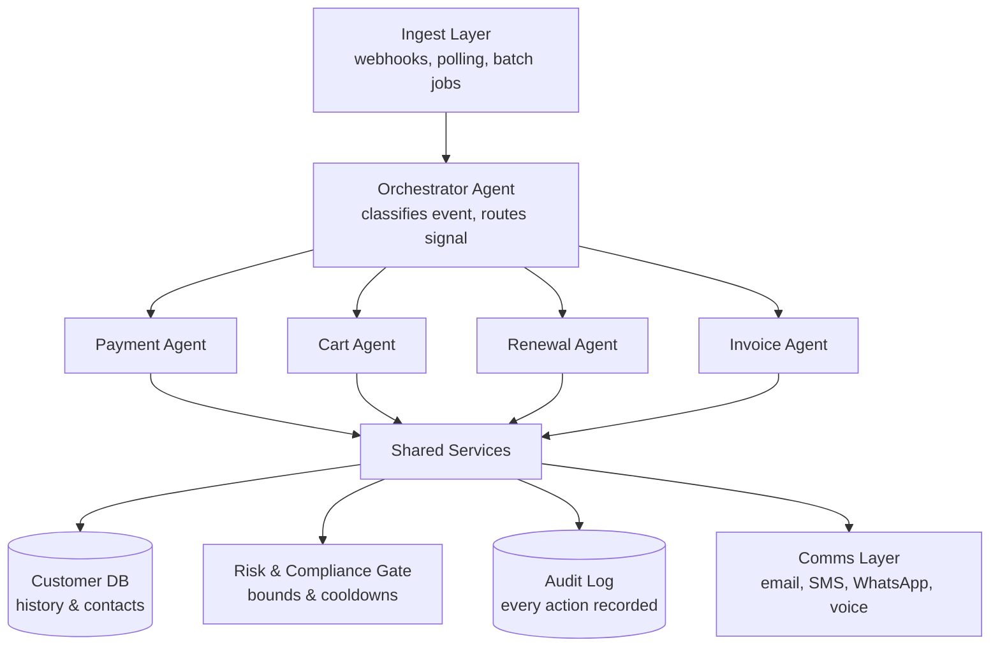
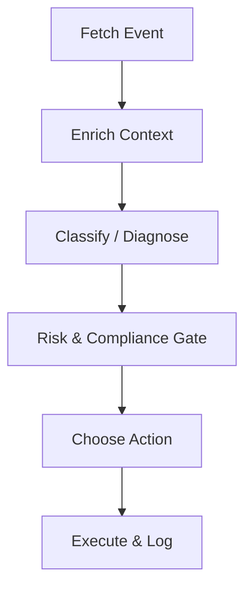

# Architecture — Revenue Recovery Agent

This is the single source of truth for system structure. Every phase's PRD refers back to this file — if a phase's implementation needs to deviate from what's written here, update this file first, then build.

## 1. Overview

A multi-agent system that watches four kinds of "leaking revenue" events (failed payments, abandoned checkouts, failed subscription renewals, overdue B2B invoices), diagnoses why each one happened, and executes a bounded recovery action — with every action gated by hard-coded compliance rules and logged to an audit trail.

One orchestrator classifies and routes each event. Four specialist sub-agents (Payment, Cart, Renewal, Invoice) each run the same six-stage internal pipeline, tuned to their domain. All four share one customer database, one risk/compliance gate, and one audit log.

## 2. System Architecture



## 3. Components

| Component | Type | Responsibility |
|---|---|---|
| Ingest Layer | Deterministic code | Accepts events from synthetic generator or real Razorpay test-mode API, normalizes into the internal Event schema (Section 6) |
| Orchestrator Agent | LLM (DeepSeek V4 Flash) | Classifies event type, routes to correct sub-agent |
| Payment / Cart / Renewal / Invoice Agents | Mixed (rules + LLM) | Domain-specific diagnosis and recovery decision — see Section 5 |
| Customer DB | Deterministic code (Postgres/Supabase) | Stores contact history, retry counts, past failures — read by Enrich step, read/write by Risk Gate |
| Risk & Compliance Gate | Deterministic code — **never an LLM call** | Enforces max retries, cooldown windows, contact frequency caps |
| Audit Log | Deterministic code (Postgres/Supabase) | Records every action taken, with reasoning, for the demo dashboard and judge review |
| Comms Layer | Deterministic code (Twilio + SMTP) | Shared functions `send_email()`, `send_sms()`, `send_whatsapp()`, `place_voice_call()` — every agent calls into this, none implement their own messaging |

### Template Convention

Message templates are organized one file per scenario, with one `MessageTemplate` constant per supported channel variant. The shared `render()` loader fills placeholders and raises `KeyError` for missing values. Rendering happens in an agent's Execute step; Comms Layer senders receive already-rendered content and remain domain-agnostic.

```python
@dataclass
class MessageTemplate:
    channel: str
    subject: str | None
    body: str

def render(template: MessageTemplate, **kwargs) -> MessageTemplate:
    rendered_body = template.body.format(**kwargs)
    rendered_subject = template.subject.format(**kwargs) if template.subject else None
    return MessageTemplate(channel=template.channel, subject=rendered_subject, body=rendered_body)
```

## 4. Sub-Agent Internal Pipeline (generic pattern)

Every sub-agent follows this exact six-stage shape. This consistency is a deliberate design choice — don't let any sub-agent skip a stage or reorder it.



- **Fetch Event** — deterministic, reads the normalized event off the queue/table
- **Enrich Context** — deterministic, plain DB lookup joining customer history onto the event
- **Classify / Diagnose** — hybrid: rules handle clean signals (decline codes, days overdue), LLM only invoked for genuinely ambiguous cases
- **Risk & Compliance Gate** — deterministic, hard-coded if/else logic, provably bounded, no LLM ever
- **Choose Action** — LLM or rules depending on sub-agent (see Section 5)
- **Execute & Log** — deterministic, performs the mock action and writes to Audit Log

## 5. Per-Sub-Agent Domain Specifics

| Sub-agent | Enrich pulls | Diagnose logic | Gate checks | Decide options | Channels used |
|---|---|---|---|---|---|
| Payment | Past retries, method reliability | Rules map decline code → cause; LLM adds nuance if code is ambiguous | Max retries, cooldown window | Retry now / retry alt route / send payment link | SMS, WhatsApp |
| Cart | Purchase history, price sensitivity | LLM scores likely reason (price, timeout, distraction) — no clean signal exists | Contact frequency cap | Nudge (+ discount if price-related) → collect feedback → optional voice call if unresolved | WhatsApp (with discount), Email, feedback quick-reply, Hinglish voice call |
| Renewal | Tenure, past failures, LTV | Rules classify card-expiry vs funds vs processor error | Grace period rules, retry limit, separate call-frequency cap | Silent retry / prompt card update / grace period, multi-channel notify, escalate to voice call if high-value or unresponsive | SMS + Email + WhatsApp simultaneously, Hinglish voice call |
| Invoice | Account reliability, tier, past promises | Rules bucket by days overdue (30/60/90) | Contact rules, escalation limits | Reminder / firm follow-up / escalate, with a call-priority score deciding who gets called | SMS, WhatsApp, Email, Hinglish voice call (priority-scored) |

## 6. Internal Event Schema

Every external source (synthetic generator, real Razorpay API) must be converted into this shape by an adapter before it enters the pipeline. Nothing downstream should ever see a raw external payload.

```
Event {
  event_id: str
  event_type: enum[payment_failed, cart_abandoned, renewal_failed, invoice_overdue]
  customer_id: str
  amount: float
  currency: str
  reason_code: str | null      # raw decline/status code if available
  timestamp: datetime
  metadata: dict                # event-type-specific extra fields
}
```

## 7. Data Flow (end to end)

1. Event enters via Ingest Layer (synthetic generator or real API adapter) → normalized to Event schema
2. Orchestrator classifies `event_type`, routes to matching sub-agent
3. Sub-agent's Enrich step joins Customer DB history onto the event
4. Diagnose step determines root cause (rules and/or LLM)
5. Risk Gate checks bounds — if blocked, log the block and stop; if allowed, continue
6. Decide step picks the specific action
7. Execute step performs the (mocked) action and writes an Audit Log entry
8. Dashboard reads Audit Log + computes batch metrics (recovery rate, ₹ recovered)

## 8. Tech Stack Recap

| Layer | Choice | Why |
|---|---|---|
| Backend | FastAPI (Python) | Already used in Intra, async-friendly for ingestion |
| Orchestration | LangGraph | Same primitive as Intra's six-node graph, proven pattern |
| LLM inference | Groq / OpenRouter (cloud) | Local 8GB VRAM ceiling (14B) insufficient for reliable live-demo reasoning |
| Database | Supabase/Postgres | Already used in Intra, gives relational tables + instant REST |
| Frontend | React + Vite + TypeScript | Already used in Intra, dark terminal aesthetic reusable |
| Synthetic data | Python `faker` | Realistic fake data with minimal code |

## 9. Phase-to-Architecture Mapping

| Phase | Builds |
|---|---|
| 1 | Ingest Layer skeleton, Event schema, Customer DB tables, Orchestrator routing skeleton (stubs only) |
| 2 | Payment Agent — full six-stage pipeline (the template for Phases 3–4); Comms Layer v1 (email, SMS, WhatsApp) built here since Payment's "send payment link" action needs it first |
| 3 | Cart Agent, Renewal Agent; Comms Layer extended with feedback collection and voice call (Hinglish TTS via Twilio Voice) |
| 4 | Invoice Agent (adds call-priority scoring), full system integration test (mixed batch through Orchestrator) |
| 5 | Real Razorpay test-mode adapter (Payment branch only), Dashboard |
| 6 | Hardening, docs, demo recording |

## 10. Non-Negotiable Design Principles

- The Risk & Compliance Gate is **always** deterministic code. Never route a gate decision through an LLM call.
- The Enrich step is **always** a plain DB lookup. Never an LLM call.
- Diagnosis is a **hybrid**: rules first wherever a clean signal exists (decline codes, days-overdue buckets); LLM only for genuinely ambiguous cases.
- There is exactly **one** internal Event schema. External sources are translated into it via adapters — nothing downstream ever branches on "which source did this come from."
- The Comms Layer is the only place that talks to Twilio/SMTP. No sub-agent implements its own email/SMS/WhatsApp/voice sending — they all call the shared `send_email()` / `send_sms()` / `send_whatsapp()` / `place_voice_call()` functions.
